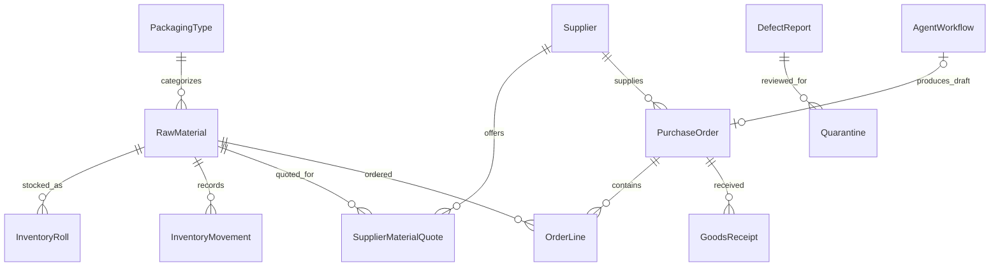

# Architecture decisions

## ADR 1 — Keep the existing integrated stack

Status: adopted. React and Flutter share ASP.NET Core business APIs and PostgreSQL. FastAPI remains an internal analysis service. This preserves the existing role CRUD and authoritative enforcement, rather than introducing a student-specific server/workflow. Cost: both backend DTOs and AI contracts must remain compatible.

## ADR 2 — Four AI responsibilities with deterministic coordinator routing

Status: adopted. Retain Planner, Data Extraction, Purchasing and Validation/Safety. Production tools and `supervisor_node` belong to the planner/coordinator. Structured plans, results and summaries are stored; hidden chain-of-thought is excluded. Routing after validation is deterministic, with three total supplier selections and distinct QA/data/service failures. Cost: explicit rules must be maintained when procurement policy changes.

## ADR 3 — Shared supplier policy and backend safety enforcement

Status: adopted. Purchasing and validation independently apply the same eligibility/ranking contract: prefer approved internal quotes, then actual rounded cost, lead time and stable identity. No implicit unit/currency conversion. The backend rechecks safety/business constraints and owns mutations, payment and email. AI results remain recommendations. Cost: external suppliers need human onboarding and proper quotes before they become eligible.

## ADR 4 — Durable local state and backend-owned publication

Status: adopted. SQLite supports durable local execution/restart state. Signed authenticated publication sends bounded summaries to the backend's AgentWorkflows table, which client dashboards read. Failed publication remains pending and blocks readiness; retries use a fresh authorized session, without storing JWTs. Backend QA decisions take precedence over stale local state. Cost: unattended retry across expired sessions needs a separately provisioned service identity, not stored user credentials.

## ADR 5 — Explicit production association and optional legacy compatibility

Status: adopted. Add nullable material, machine and material-per-output fields to shifts through a forward migration. New AI production calculations use an exact material schedule and stored conversion. Legacy capacity-only records keep their historical CRUD behavior and cannot fabricate a BOM. Cost: the team must enter real associations for production advice to be available.

## ADR 6 — UI state, role shells and route loading

Status: adopted. React retains its existing context/hooks approach; Flutter retains its current application state/services. Shared role shells own navigation, nested pages avoid duplicate headers, and React pages load lazily to reduce the initial bundle. Supplier list search/paging is server-side. Cost: every role still needs actual-device/browser walkthrough evidence. A state-management framework rewrite is not necessary for these fixes.

## ADR 7 — Reproducible tests before hosted deployment

Status: prepared. CI runs backend/PostgreSQL, agent, React and Flutter checks and packages Android only after checks pass. Docker service networking is supplied for review; the real cloud target is undecided. Local API timing uses ASP.NET TestServer/InMemory and is explicitly labeled; it does not predict cloud/network/PostgreSQL performance. Cost: hosted load testing, HTTPS, backups, provider configuration and deployment credentials remain operator tasks.

## Data relationships (logical overview)

Shift.MaterialSku, MachineId and MaterialPerUnit are explicit context fields validated by ShiftService. The diagram is a logical overview, not a complete generated physical database schema. The project retains two EF contexts over shared tables; migration tests check mapped columns and preserve existing records.
