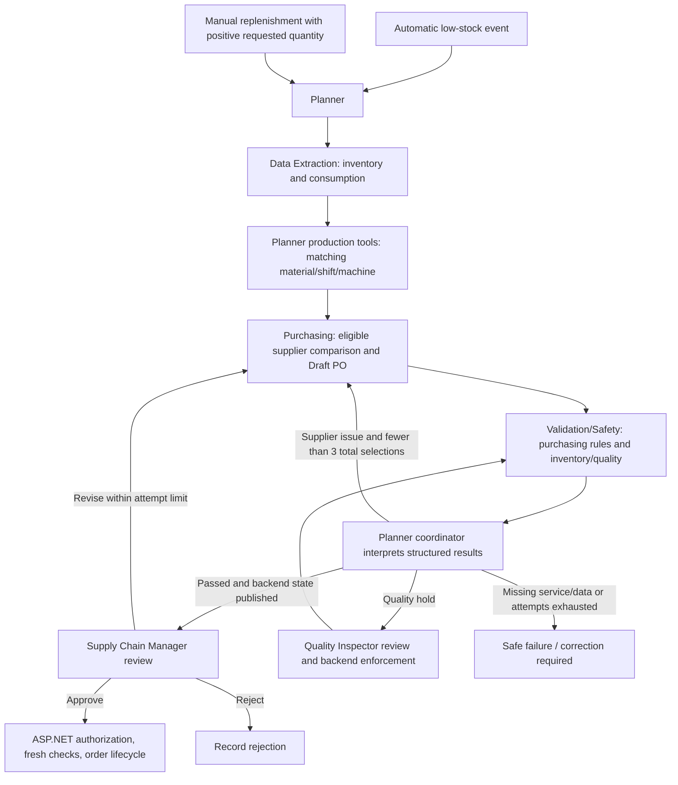

# Four student components and workflow ownership

## Shared architecture and cooperative workflow

Planner is the coordinator; `supervisor_node` is its deterministic routing function, not a fifth mandatory agent. Specialist agents return structured evidence. A supervisor between every tool call would add latency without another useful decision. Routing is needed after a specialist result requires a decision, particularly validation. There are three total supplier selections, including the initial selection. QA/service failures are not blindly retried by choosing suppliers.

Human approval is separate from payment, supplier email and receipt. Actual payment/delivery results are owned by ASP.NET Core. A purchasing recommendation never claims that payment succeeded or stock arrived.

## Student 1 — Floor Worker: Inventory & Stock Tracking

**CRUD and operational ownership:** catalogue inventory/items and raw materials, physical rolls, consumption/movement history, stock levels and alerts. Inventory creation/update/deletion routes remain protected according to their existing role rules; the Floor Worker is not authorized to modify supplier or equipment records. Receiving deliveries records actual received quantities and uses an idempotent receipt key. Consumption validates roll status and available quantity before updating stock. Referenced business records must retain their audit relationships instead of being destructively removed.

**Normal workflow:** select the catalogue material → register/receive stock or consume a usable roll → ASP.NET validates the operation → stock and movement history update → low-stock alert/replenishment trigger if applicable. A worker can also request a specified positive quantity manually, including when stock is above the minimum.

**Individual AI contribution:** the existing read-only extraction path analyzes the selected material with `get_inventory_levels`, `query_inventory_history`, `calculate_burn_rate`, and `detect_low_stock`. It returns current/min/max stock, consumption, burn rate, estimated coverage, low-stock status and the authoritative requested/recommended requirement. It does not order stock or mutate PostgreSQL. With stock 350 and burn 80, coverage is 4.375 days and the default seven-day warning flags low stock. Zero recorded consumption produces null coverage with an explanation, not fabricated 999-day coverage.

**Cooperative contribution:** Data Extraction supplies `inventory_data` and tool results to the planner's production analysis and Purchasing. Purchasing preserves the explicit manual quantity; automatic procurement uses the authoritative deficit. Coverage is rechecked when the selected supplier's delivery lead time is known. A missing/invalid material, invalid response or inventory timeout safely stops analysis.

**Implementation:** `backend/Controllers/InventoryController.cs`, `backend/Services/InventoryService.cs`, `ai/agents/data_extraction.py`, `ai/tools/inventory_tools.py`, `ai/schemas/inventory_schemas.py`. React worker pages and Flutter worker screens use the backend APIs.

## Student 2 — Supply Chain Manager: Suppliers & Purchasing

**CRUD and operational ownership:** create/read/update suppliers, deactivate suppliers, maintain approved material quotes, create/read/update permitted purchase orders and order lines, and control approve/reject/revise decisions. The existing purchase-order lifecycle also handles authorized payment, sending and delivery status through backend service contracts. Cancellation/deactivation must respect current status and references.

**Normal workflow:** maintain an active supplier and its exact material quote → create a manual order or review an AI draft → backend/QA checks → manager approves/rejects/revises → backend performs the authorized order/payment/notification lifecycle → actual receipts update inventory through Student 1's contract.

**Individual AI contribution:** the existing procurement research/selection interface invokes the shared workflow. Purchasing tools include `query_supplier_rates`, `query_internal_supplier_data`, `calculate_purchase_quantity`, `calculate_total_cost`, `validate_supplier_candidate`, `select_supplier`, `create_draft_po` and optional grounded external research. The system uses deterministic MOQ, pack-size, availability, budget, supplier status and price checks. Approved internal suppliers take preference; equivalent eligible quotes rank by actual rounded order total, delivery time and stable supplier identity. Purchasing and independent validation use the same ranking policy.

**Cooperative contribution:** receives exact material and quantity from extraction/request state; returns the complete comparison set, selected supplier, rounded quantity/cost and Draft PO. Validation checks the proposal independently. Correctable supplier failures return to purchasing within three total attempts. External research is unverified and cannot become an approved supplier automatically. Quotes in an incompatible unit/currency are rejected until an explicit conversion exists; the current budget contract is LKR.

**Implementation:** `backend/Controllers/SuppliersController.cs`, `backend/Controllers/PurchaseOrdersController.cs`, `backend/Services/PurchaseOrderService.cs`, `backend/Services/PurchaseOrders/ProcurementService.cs`, `ai/agents/purchasing.py`, `ai/tools/purchasing_tools.py`, `ai/core/supplier_ranking.py`. Supplier React search/filter/sort/paging now occurs on the server.

## Student 3 — Quality Inspector: Quality & Safety

**CRUD and operational ownership:** defect reports and their status, quarantine records and affected inventory links, controlled quarantine/release decisions, review notes and AI validation resolution. Reporting can originate with the worker, but quarantine/release and QA resolution belong to the Quality Inspector. Backend validation protects active holds and roll status regardless of the AI recommendation.

**Normal workflow:** inspect/report a defect → optional AI analysis → inspector reviews the recommendation and affected rolls → ASP.NET validates and applies quarantine → review/release through authorized backend rules. A QA clearance does not grant financial approval or clear failed supplier/math/budget checks.

**Individual AI contribution:** `/api/defects/analyze` proxies an authenticated QA request to the existing Validation/Safety tools: `analyze_defect_context`, `check_related_inventory`, `recommend_quarantine`. They assess severity, related stock and actual holds, and return a recommendation. This is a tool slice of Validation/Safety, not an additional mandatory agent or independently executing order workflow. AI recommendations never directly quarantine database rows.

**Cooperative contribution:** Validation/Safety receives the selected proposal, checks schema, supplier, quantity, MOQ, pack-size, availability, budget, mathematics and best-choice evidence, and verifies quarantine/inventory status. It returns evidence; the planner coordinator chooses approval, bounded reselection, QA review or safe failure. Backend draft creation and approval interpret all required check fields, not only `isValid`. QA manual decisions remain authoritative in PostgreSQL and cannot be overwritten by a stale AI publication.

**Implementation:** `backend/Controllers/DefectReportController.cs`, `backend/Controllers/QualityAiValidationController.cs`, quarantine services/controllers, `backend/Helpers/QualityValidationPolicy.cs`, `ai/agents/validation.py`, `ai/agents/quality_agent.py`, `ai/tools/quality_tools.py`. Unauthenticated AI quality requests and non-QA roles are rejected.

## Student 4 — IT Admin: Production, Equipment & Coordination

**CRUD and operational ownership:** machines, maintenance records, shifts and output adjustment; administration also includes users/roles, audit and system/workflow monitoring subject to existing authorization. Equipment/shift writes belong to IT Admin. Maintenance approval is distinct from procurement financial approval, which belongs to the Supply Chain Manager.

**Normal workflow:** register equipment → maintain operational hours and maintenance interval → schedule a shift → associate catalogue material/machine and material used per finished unit → calculate feasible output → perform authorized maintenance/update operations. Existing legacy capacity-only shifts keep their previous calculation.

**Individual AI contribution:** the existing maintenance/planning interfaces use `query_production_schedule`, `calculate_machine_uptime`, `check_maintenance_requirement` and `calculate_production_impact`. For uptime 480 and interval 500, maintenance is not due; at 520 it is due. Production output is limited by material divided by the stored material-per-output conversion. With target 10000, material 6000 and conversion 1, output is 6000; conversion 2 yields 3000.

**Cooperative contribution:** Planner builds the structured plan, delegates through the existing LangGraph, records completed steps/tool summaries and coordinates the validation decision. Production analysis reads a matching material shift and associated machine, never the global latest shift for another product. Missing optional production context is reported as unavailable and cannot invent a conversion or overwrite an authoritative purchasing quantity. Supplier/inventory/validation failures remain safe and visible; approval is never bypassed.

**Implementation:** `backend/Services/ShiftService.cs`, machine/shift/maintenance controllers, `backend/Models/Production/Shift.cs`, `ai/agents/planner.py`, `ai/agents/production_analysis.py`, `ai/agents/supervisor.py`, `ai/tools/production_tools.py`, `ai/graph/workflow.py`, `ai/core/state.py`.

## Cross-component compatibility and checks

- Existing list-array APIs remain available; separate bounded `/paged` endpoints support inventory, suppliers, machines, defects and purchase orders. React supplier paging is integrated; the other existing clients continue using their previous contracts.
- Shift associations are nullable and added by a forward migration; old data is not assigned an invented material/BOM. React supports the new fields; Flutter reads and preserves association fields and the correct `productionTarget` property.
- FastAPI publishes signed summaries through ASP.NET Core and retains local state on failure. Pending synchronization is visible and blocks manager readiness. No bearer token or hidden chain-of-thought is persisted.
- React routes load lazily; shared role shells handle navigation. Mobile nested procurement screens keep one shell app bar.
- Golden, role authorization, real graph-node handoff, quarantine, supplier retry, migration and durable failure tests provide automated evidence. See `IMPLEMENTATION_REPORT.md` for verified results and their limits.
